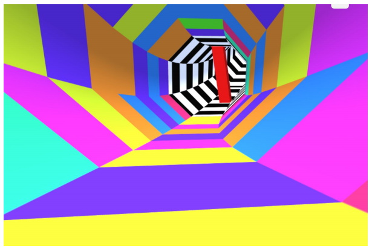

Tunnel Rush using WebGL
=====================

## About the game
This is a simple WebGL clone of Tunnel Rush game. The game has several features like textures, lighting and shadows. A sample of how the game looks like is given below:

<p align="center">
  
</p>

## 1. How to run the game

### First compile:

```
install webGL supporting web broweser like firefox.
open index.html in it.
```

## 2. Controls :
* The user can play by keyboard.

##### Keyboard Controls

|                    KEY |       ACTION |
| ---------------------: | -----------: |
|space bar |         Jump |
|       a |  Rotate left |
|      d | Rotate right |
|                      P |        Pause |
|                      B |    Greyscale |


## 3. Scoring

- Depends on the distance travelled.

## 4. Rules

* You have a total of  lives to compete in the game.
* You move on to the next level after scoring multiple of 100 pnts.
* The obstacles start rotating after two levels
* Hitting the obstacles makes you lose life.
* We can use use jump feature to escape 2nd obstacle around middle peices.

## 5. Additional Features

* The game has background audio implemented using threading.
* Multiple sounds for collision, sound
* Score, Life and Level integrated + Displayed on canvas.
* Speed increases with levels.
* Gameover splash screen.
* Game can be paused. 
* Lighting, flash and texures are implemented.

License
-------
The MIT License

Copyright &copy; 2018 Shashank <s.shashank2401@gmail.com>